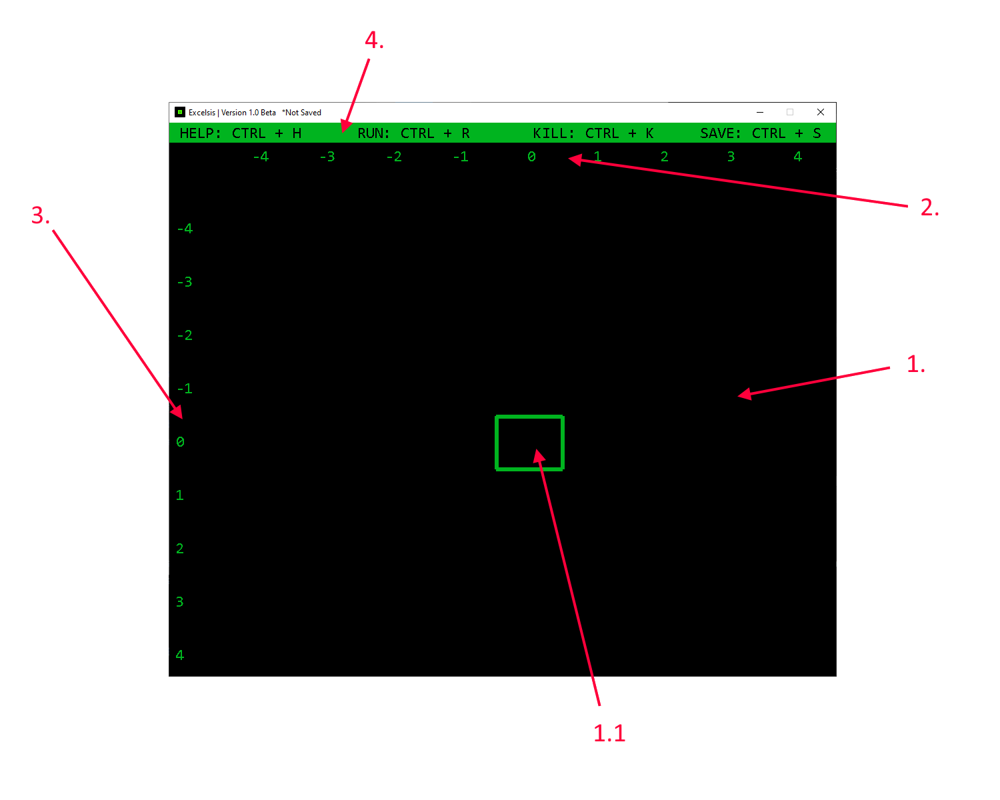
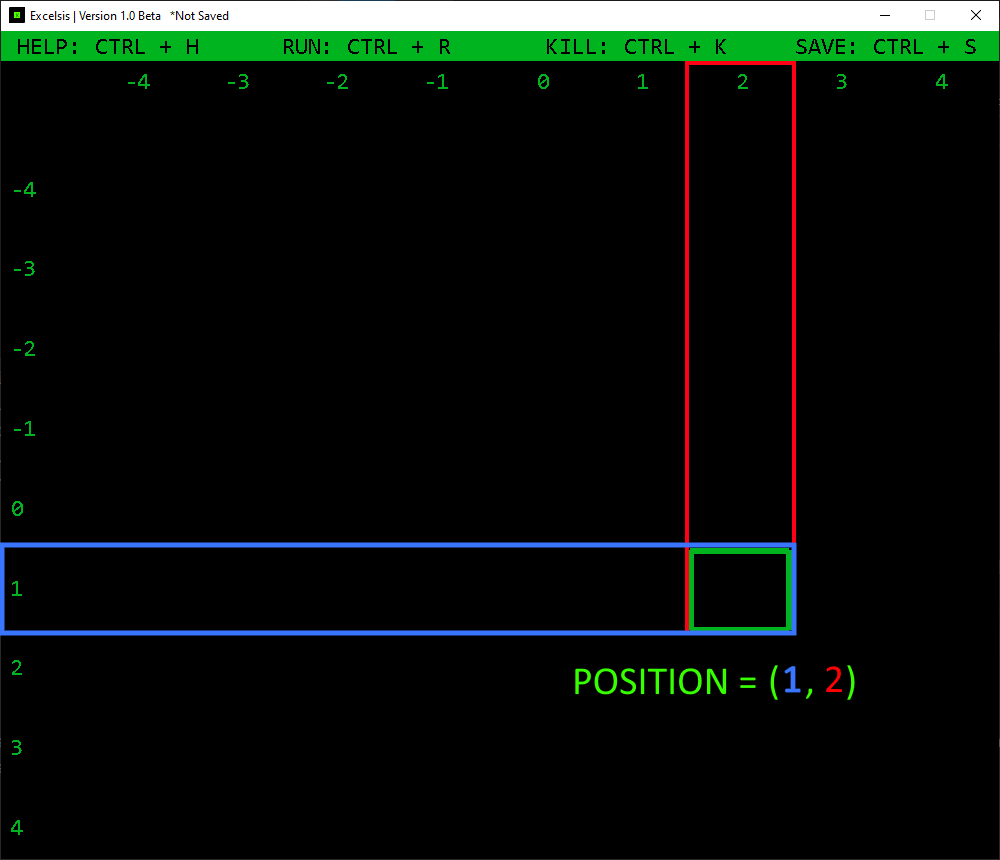
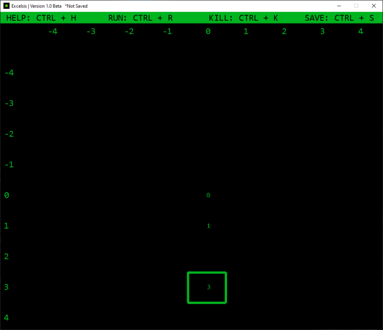
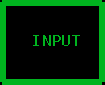
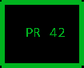
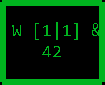
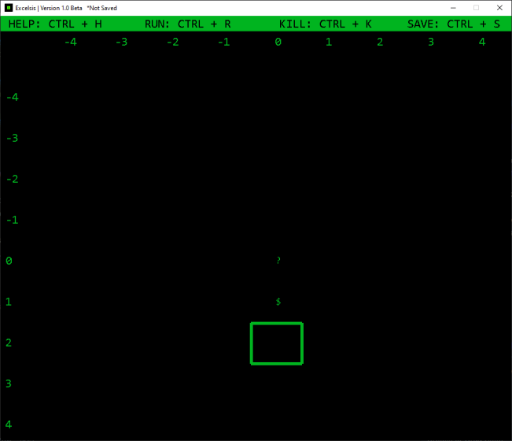
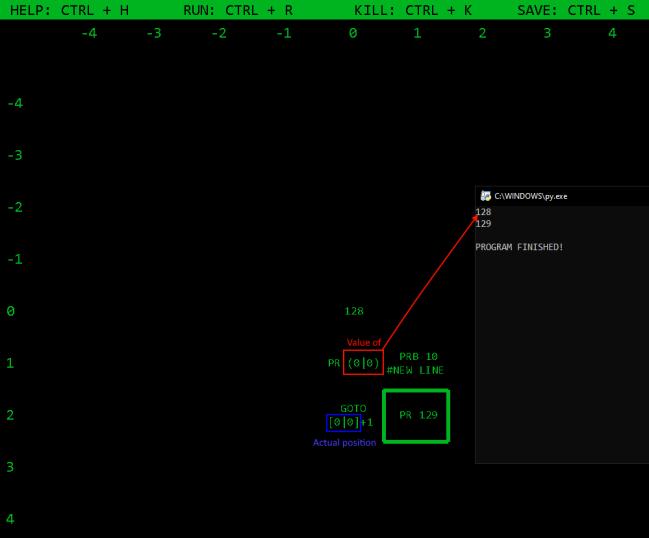

# Excelsis

Excelsis is an esoteric programming language made in Python with an in-built IDE.
It is similar to Basic but is written on an infinite grid.

# Dependencies

In order to use Excelsis you need to have **pygame** and **win32gui** libraries installed on your machine.
You can install **pygame** and **win32gui** by opening the cmd and writing following commands:
```
$ pip install pygame
$ pip install win32gui
```
If the installation of **win32gui** fails try installing **pywin32** by writing the following command:
```
$ pip install pywin32
```

# How to get started

### Loading and saving
When you open the IDE by double-clicking on **launcher.py** file, a terminal will open. It will ask you to input a path
to the file you want to load. ExcelsisIDE only excepts files that end with **.pkl** and have been created by the
ExcelsisIDE.

ExcelsisIDE will then ask you to input a file where you want to save your program. If you don't enter the path you will not be able to save your program.

### Running

To run Excelsis program in the ExcelsisIDE you need to press _CTRL + R_. To stop the program you need to press
_CTRL + K_. Press _CTRL + S_ to save the file (works only if you entered a valid path for saving the file). If you are stuck
you can get help by pressing _CTRL + H_.

TODO: double clicking on .pkl file opens it with Excelsis

### First Program

#### Movement
When you finish with all the file-related needs, the ExcelsisIDE will open. It is composed of 4 components:


   1. Cell grid
         * Selected cell
   2. Horizontal ruler
   3. Vertical ruler
   4. Help bar
   
  
The cell grid is where you write your code. The Selected cell is the cell that has green edges. You can move on the cell grid
with arrow keys. The help bar shows you all keyboard shortcuts. To figure out where are you currently located on the cell
grid you can look at vertical and horizontal rulers, For example:



> Note: In Excelsis the first number in position **always** represents the y-axis value.


Standard position notation in Excelsis is `[y_pos|x_pos]` so from now on I will
be using that notation instead of the standard math notation. 

#### Program flow

The code execution starts on cell `[0|0]`. Cells are interpreted and executed one at a time going downwards.
The code execution stops when the interpreter reaches an empty cell. So if you had something like this:


The program will start at `[0|0]` and write a 0 in that cell. Then it will go one cell down to cell `[1|0]` where it will write 
1 in cell `[1|0]`. The program continues the same way as explained until it reaches cell `[4|0]` where it halts.

If we take a look at this example:



Program will never reach cell `[3|0]` so cell `[3|0]` will never be interpreted.

#### Data types and arithmetics

In Excelsis there are 4 different data types:
 * INT - integer
 * FLOAT - floating point number
 * CELL POSITION - it looks like this: `[x_pos|y_pos]`, and can't be outputted to the terminal
 * FUNCTION - functions can't be created, outputted to the terminal or used in arguments and arithmetics
 
Defined arithmetics operations for _INT_ and _FLOAT_ are:
 * Addition - any combination of _INT_ + _FLOAT_
 * Subtraction - any combination of _INT_ - _FLOAT_
 * Multiplication - any combination of _INT_ * _FLOAT_
 * Division - any combination of _INT_ / _FLOAT_
 
Defined arithmetics operations for _CELL POSITION_ are:
 * Addition - _CELL POSITION_ + _CELL POSITION_, _CELL POSITION_ + _INT_, _INT_ + _CELL POSITION_
 * Subtraction - _CELL POSITION_ - _CELL POSITION_, _CELL POSITION_ - _INT_, _INT_ - _CELL POSITION_
 * Multiplication - _CELL POSITION_ * _INT_, _INT_ * _CELL POSITION_
 * Division - _CELL POSITION_ / _INT_, _INT_ / _CELL POSITION_
 
#### Functions

Excelsis has 7 in-built functions:

 * `FLOAT` - Arguments(_FLOAT_ or _INT_), the cell takes on that value converted to _FLOAT_
 * `GOTO` - Arguments(_CELL POSITION_), moves the program execution to the cell that is passed as argument.
 * `INPUT` - Arguments(No argument), ask a user to input a _FLOAT_ or _INT_ and when the user pressed enter the cell takes on that value
 * `INT` - Arguments(_FlOAT_ or _INT_), the cell takes on that value converted to _INT_
 * `PR` - Arguments(_INT_), writes the argument value to the terminal
 * `PRB` - Arguments(_INT_), writes the ascii character corresponding to the argument value
 * `W` - Arguments(_CELL POSITION_ and (_INT_ or _FLOAT_ or _CELL POSITION_)), writes the second argument in the cell position that is passed as the first argument

Functions can only go on the beginning of the cell and can't be passed as arguments. Arguments are separated from function names
by at least one **space**. Arguments are mutually separated by one **space** followed by `&` and then another **space**.


> INPUT function with no arguments


> PR function with one argument of type _INT_


> W function with multiple arguments separated by `&` and spaces


#### Zero-argument functions (ZARGS) and expressions

Zero-argument functions are special kinds of 'functions' in Excelsis that take no arguments and still have different values, depending on where you use them.
There are two zero-argument functions in Excelsis:
 
 * `?` - Question-mark ('MARG') represents the _CELL POSITION_ of the cell that is currently being interpreted
 * `$` - Dollar-sign ('DARG') represents the previous _CELL POSITION_, better to say the position of a cell that lead the program 
to the cell that is currently being interpreted. If you use `$` on the cell `[0|0]` it will return `[0|0]`

Let's take the image below as an example:


As you can see in the cell `[0|0]` there is a MARG which means that cell will take on _CELL POSITION_(`[0|0]`). The program
will then go to cell `[1|0]` in which is a DARG. Cell `[1|0]` will hence take on previously interpreted _CELL POSITION_ - `[0|0]`.

Expressions in Excelsis are everything associated with parentheses - `()` and square brackets - `[]`. When it comes to arithmetics
everything works the same way as in math. _CELL POSITION_ are considered as matrices when dealing with _CELL POSITION_ to _INT_ 
arithmetics. Here are some examples:
- `2 * (2 + 2) = 8`
- `2 * (1 / (2)) = 1.0`
- `2 * [2 + 2] = 8`
- `2 * [1 / [2]] = 1.0`
- `12 + [0|0] = [12|12]`
- `3 - [0|0] = [-3|-3]`
- `[1|2] + [5|6] = [6|8]`
- `[1|-1] - [-1|1] = [2|-2]`
- `[1|0] * 100 = [100|0]`
- `[3|8] / 3 = [1|2]`
> Note: Only difference when dealing with _CELL POSITIONs_ is that _INT_ * _CELL POSITION_ is actually _CELL POSITION_ * _INT_ and same with all other operations.

When working with cell positions expressions work a little bit differently. If we put something like `0|0` in parentheses,
we will not get the _CELL POSITION_, but the **value of the cell at that position**. So `(0|0)` and `[0|0]` are totally different.
With parentheses, we access the value of the cell and with square brackets, we get the _CELL POSITION_ as a data type.

Let's take a look at this example:


Program starts at `[0|0]` and writes number 128 in `[0|0]`. Then it goes to cell `[1|0]` where **the value** of the cell
`[0|0]` is printed. Program then goes to cell `[2|0]` where function `GOTO` moves execution to cell `[1|1]` because if you recall: `[0|0] + 1 = [1|1]`.
Cell `[1|1]` then prints a new line ("\n" is 10 in ascii table). Finally the program goes to cell `[2|1]` and prints number 129
after which it halts.

Playing with these expressions is sometimes dangerous because if you put `(?)` in a cell you will get a recursion error.
And if you think about it, this expression doesn't make a lot of sense. How can you get the value of the cell if part of
the value of that cell is the value of the cell? This sounds really confusing because it is, that expression just isn't
possible to interpret.

#### Comments

For the end, I left the easiest part - comments.

There isn't much to talk about here. Comments work the same way as in python. Everything after hashtag(`#`) will
not be considered as part of the code. One comment applies to only one cell and to all lines in that cell.

# Explore

> Note: In `examples` folder are already some programming problems solved in Excelsis.

Try to solve some popular programming problems with Excelsis or write a program in Excelsis and if you want you can send
it here with some comments about how can we make Excelsis better and more fun :)

# Credits

Credits to Grga Škec.
