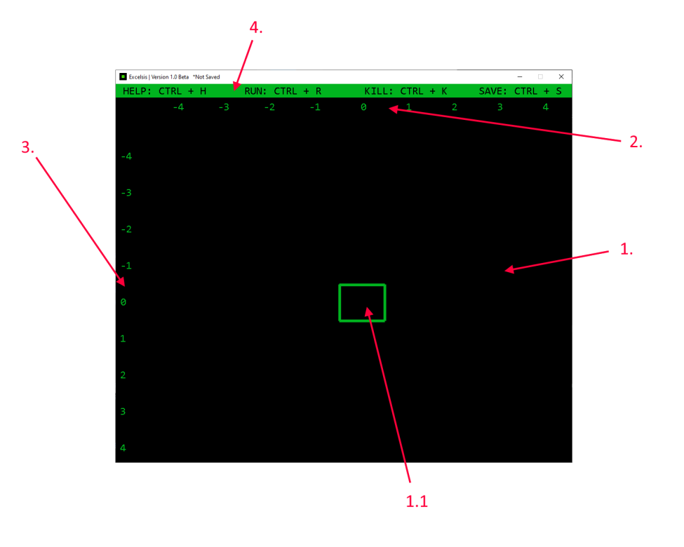

# Excelsis

Excelsis is an esoteric programming language made in Python with an in-built IDE.
Itis similar to Basic but is written on an infinite grid.

# Dependencies

In order to use Excelsis you need to have **pygame** library installed on your machine.
You can install pygame by opening the cmd and writing the following command:
```
$ pip install pygame
```

# How to get started

### Loading and saving
When you open the IDE by double-clicking on **launcher.py** file, a terminal will open. It will ask you to input a path
to the file you want to load. ExcelsisIDE only excepts files that end with **.pkl** and have been created by the
ExcelsisIDE.

ExcelsisIDE will then ask you to input a file where you want to save your program. If you don't enter the path you will not be able to save your program.

### Running

To run Excelsis program in the ExcelsisIDE you need to press _CTRL + R_. To stop the program you need to press
_CTRL + K_. Press _CTRL + S_ to save the file (works only if you entered a valid path for saving the file). If you are stuck
you can get help by pressing _CTRL + H_.

TODO: double clicking on .pkl file opens it with Excelsis

### First Program

When you finish with all the file-related needs, the ExcelsisIDE will open. It is composed of 4 components:


   1. Cell grid
         * Selected cell
   2. Horizontal ruler
   3. Vertical ruler
   4. Help bar
   
  
The cell grid is where you write your code. Selected cell is the cell that has green edges. You can move on the cell grid
with arrow keys. The help bar shows you all keyboard shortcuts. To figure out where are you currently located on the cell
grid you can look at vertical and horizontal ruler, For example:


# Explore

Try to solve some popular programming problems with Excelsis or write a program in Excelsis and if you want you can send
it here with some comments about how can we make Excelsis better and more fun :)

# Credits

Credits to Grga Škec.
